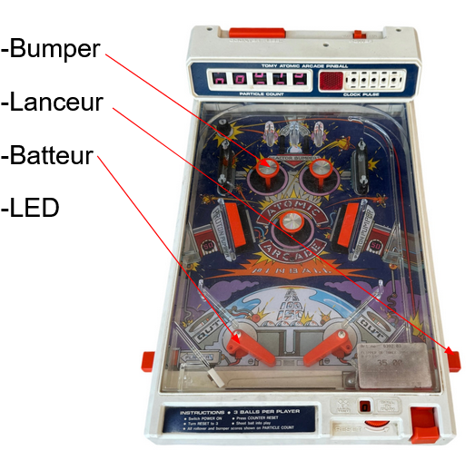
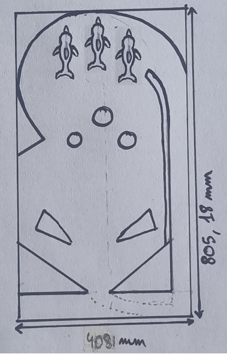
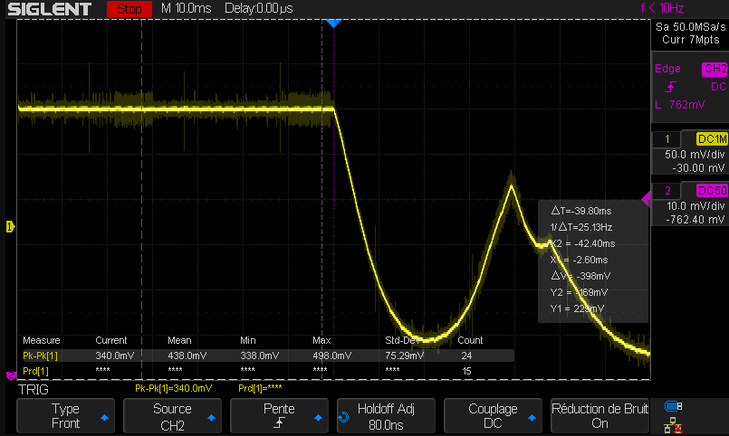
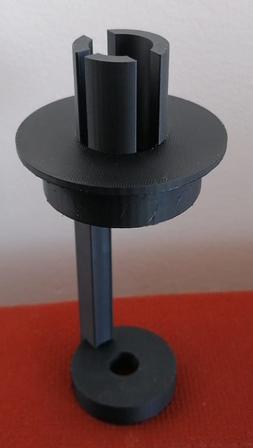
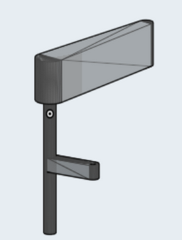
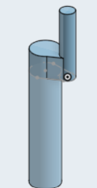
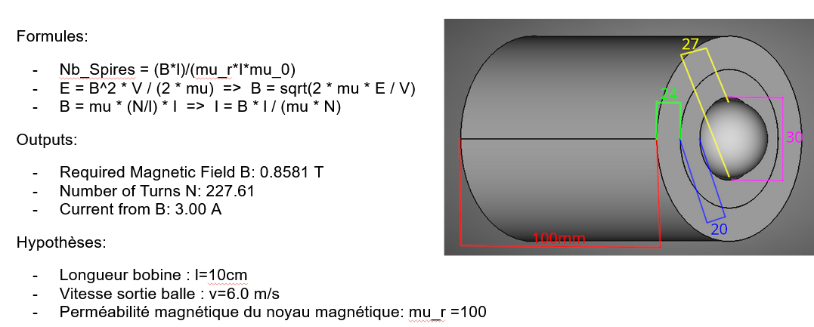
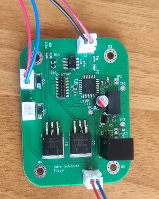
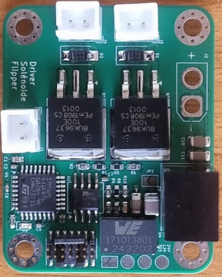

# 2526_Projet2A_Flipper
Notre objectif est de réaliser un Flipper (ou billard électrique). Notre flipper aurait tous les éléments suivants : les batteurs, les bumpers, un lanceur, un compteur de point et des éclairages (réalisés avec des néopixels), tels que montré sur les dessins suivants : 
 

Afin de marquer des points, le joueur doit soit passer entre les dauphins soit tapper contre les pièces triangulaires ou contre les bumpers.
### Matériel
Solénoïdes*4 : Heschen Electroaimant solénoïde, HS-1546B, DC24V, 1.5A, course 20 mm, type Push Pull

Néopixels alimentées à 5 V

Détails de la PCB seront donnés dans la partie concernée

Photo diode Silicium : 

### Logiciels utilisés
KiCAD (design PCB), STM32CubeIDE (Software), Onshape (Modélisation 3D)

## Les Bumpers

Le fonctionnement du bumper est le suivant : lorsque la balle arrive contre le bumper, elle boucle un circuit entre un anneau proche du circuit ainsi que le cylindre central ce qui va provoquer l'abattement d'une collerette (nommée "metal flange with studs" sur le schéma) repoussant ainsi la balle.
Pour réaliser cet "abattement" on utilise des **solénoïdes** que nous commençons par tester : 
### _Premier test solénoïde_

afin d'utiliser ces solénoïdes pour réaliser des bumpers nous avons besoin d'un support (que nous avons dessiné sur Onshape) :

Nous sommes actuellement entrain détudier si le remplissage par défaut est adapté à l'utilisation que nous souhaitons en faire
## Les Batteurs
Les batteurs sont au nombre de 2 et seront contrôlés par des boutons poussoirs qui activeront d'autres solénoïdes. Ainsi nous avons du réaliser un dispositif afin de pouvoir tranformer la translation produite par le solénoïde en rotation de 60° pour les batteurs. Par Onshape, on modélise les pièces suivantes : 

  
Nous devons encore modifier ces dessins afin d'éviter de trop gros frottement il est nécessaire d'ajouter des écrous ainsi que des tiges filletées à l'intérieur des pièces.
## Le Lanceur
La première idée afin de réaliser le lanceur est de réaliser un Coilgun dont le principe est le suivant : 
Nous prenons une balle de 27mm de diamètre que nous voulons faire aller à **6 m/s** lors du lancement ainsi le dimmensionnement de notre Coilgun serait le suivant : 

## Le PCB
Afin de commander les solénoïdes et de convertir les ... V d'alimentation nous avons réalisé (sur KiCAD) et soudé un premier PCB que voici : 

Lors des soudures nous avons rencontré plusieurs problèmes tels que des empreintes erronées
Lors des tests, le Buck de ce premier PCB a fortement monté en température. Nous sommes donc passé au montage suivant (PCB corrigé par Monsieur Papazoglou) :

Lors des test, le Buck de ce PCB est également monté en température. Pour poursuivre notre projet nous 
## Le Compteur

## Le Châssis

# Licence
Licence : MIT
