# 2526_Projet2A_Flipper
Notre objectif est de réaliser un Flipper (ou billard électrique). Notre flipper aurait tous les éléments suivants : les batteurs, les bumpers, un lanceur, un compteur de point et des éclairages (réalisés avec des néopixels), tels que montré sur les dessins suivants : 

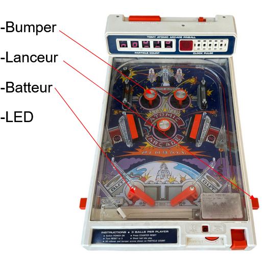 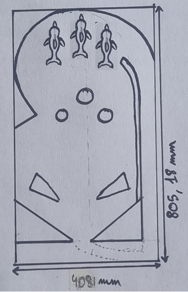

Afin de marquer des points, le joueur doit soit passer entre les dauphins soit tapper contre les pièces triangulaires ou contre les bumpers.
### Matériel
* Solénoïdes*4 : Heschen Electroaimant solénoïde, HS-1546B, DC24V, 1.5A, course 20 mm, type Push Pull

* Néopixels alimentées à 5 V

* Photodiodes*3

* Détails de la PCB seront donnés dans la partie concernée

### Logiciels utilisés
KiCAD (design PCB), STM32CubeIDE (Software), Onshape (Modélisation 3D)

## Les Bumpers
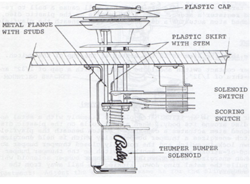

Le fonctionnement du bumper est le suivant : lorsque la balle arrive contre le bumper, elle boucle un circuit entre un anneau proche du circuit ainsi que le cylindre central ce qui va provoquer l'abattement d'une collerette (nommée "metal flange with studs" sur le schéma) repoussant ainsi la balle.
Pour réaliser cet "abattement" on utilise des **solénoïdes** que nous commençons par tester : 
### _Premier test solénoïde_

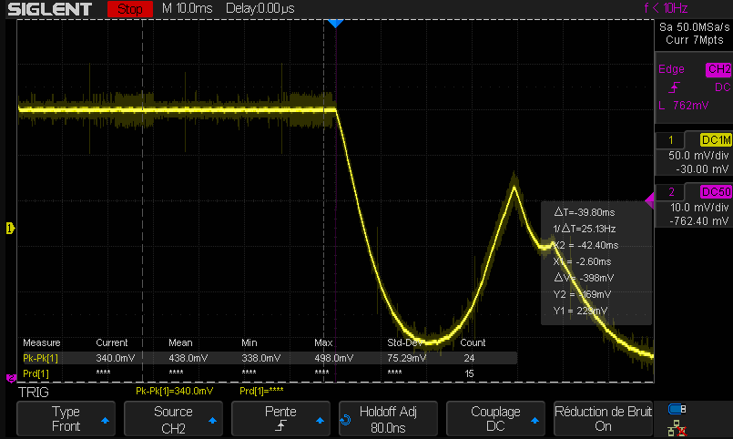

Afin d'utiliser ces solénoïdes pour réaliser des bumpers nous avons besoin d'un support (que nous avons dessiné sur Onshape) :

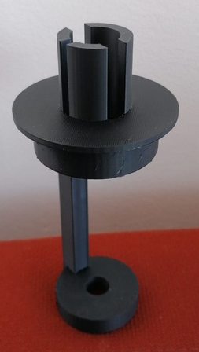

Nous sommes actuellement en train d'étudier si le remplissage par défaut est adapté à l'utilisation que nous souhaitons en faire.

Afin de détecter si la balle a touché le bumper, nous avons entouré la base et le mât du bumper de scotch cuivré. La balle, en contact avec les deux morceaux de scotch, ferme le cicuit connecté à un GPIO pin de la STM, ce qui permet de commander le solénoïde du bumper.

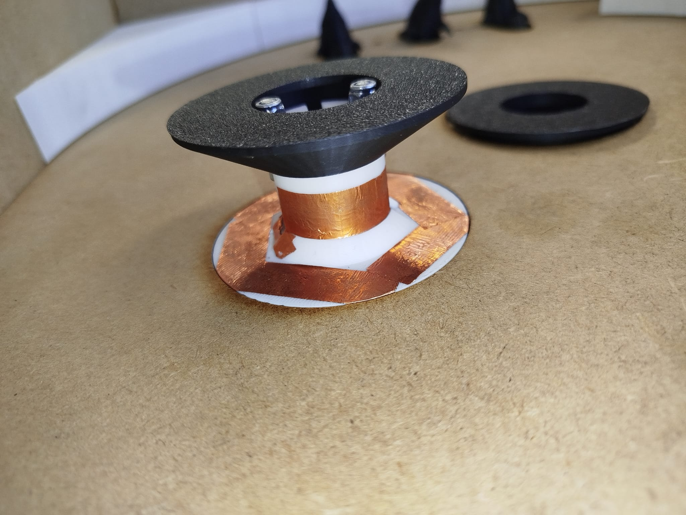

## Les Batteurs
Les batteurs sont au nombre de 2 et seront contrôlés par des boutons poussoirs qui activeront d'autres solénoïdes. Ainsi nous avons du réaliser un dispositif afin de pouvoir tranformer la translation produite par le solénoïde en rotation de 60° pour les batteurs. Par Onshape, on modélise les pièces suivantes : 

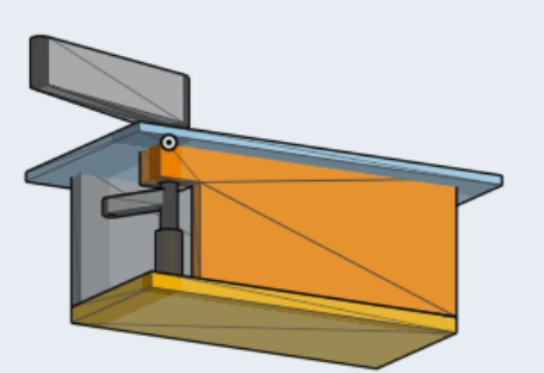 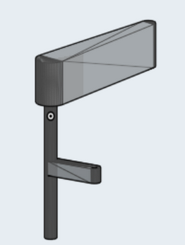 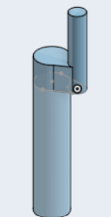

Nous devons encore modifier ces dessins afin d'éviter de trop gros frottement il est nécessaire d'ajouter des écrous ainsi que des tiges filletées à l'intérieur des pièces.\
On a remarqué que les écrous nylstops avaient une certaine marge de mouvement, ce qui désaxe les batteurs au fil du temps.

## Le Lanceur
La première idée afin de réaliser le lanceur est de réaliser un Coilgun dont le principe est le suivant : 
Nous prenons une balle de 27mm de diamètre que nous voulons faire aller à **6 m/s** lors du lancement ainsi le dimmensionnement de notre Coilgun serait le suivant : 
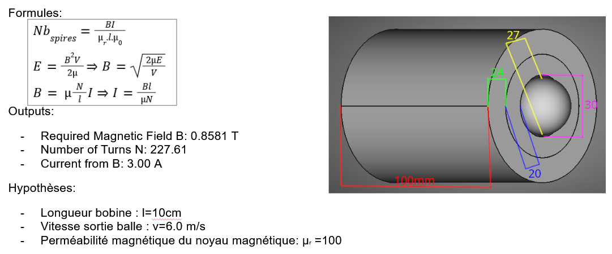

Nous avons fini par nous rabattre sur un simple ressort monté sur une tige filetée.

## Les boutons

Après plusieurs tests, nous avons remarqué que les boutons qui étaient, d'après la datasheet, pour du 5V fonctionnaient en 24V. Afin d'avoir un prototype "fonctionnel", nous avons donc simplement branché les batteurs de cette manière: 24V --- Bouton --- Batteur.\
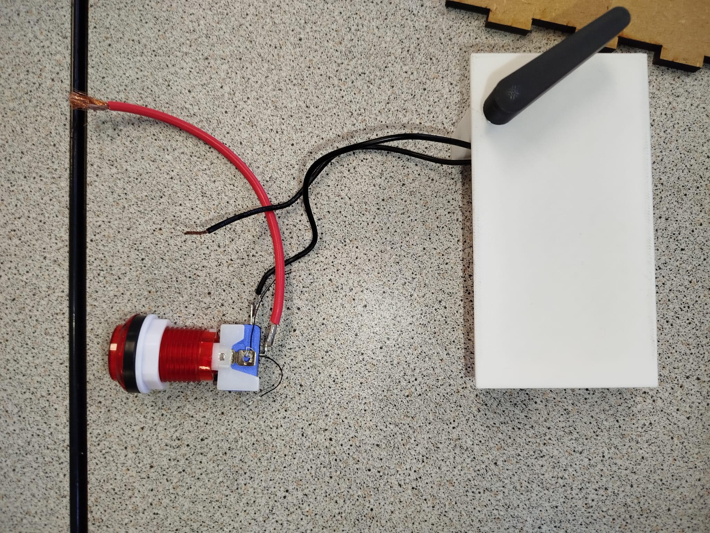

## Le Compteur
Afin d'afficher le score réalisé par le joueur nous devons réaliser un compteur, on utilisera un afficheur 7 segments.\
Pour ce faire nous utiliserons des Néopixels, le code serait réalisé en langage C.\
Voici le support (réalisé sur Onshape) sur lequel nous voulons coller et souder les néopixels : 

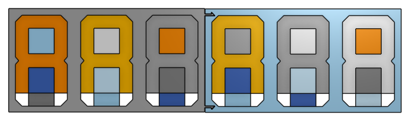 

Afin de dissiper la lumière pour ne pas être ébloui par les LED, on peut mettre un difuseur lumineux qui se compose de 1 à 2 couches de PLA.\
Nous avons remarqué que chaque LED doit être séparé par un mur afin de ne pas éclairer les parties des autres (par exemple: le 1 ressemble au 3 sans mur).

## Les Photodiodes
Afin de détecter lorsque la balle passe entre les obstacles ou lorsqu'elle heurte l'obstacle triangulaire du milieu de la table, nous utilisons des photodiodes.
Les premiers tests avec un PCB fait par Monsieur Papazoglou ont été laborieux, on remarque que pour vérifier que ces photodiodes sont bien fonctionnelles nous pouvons lorsqu'elles sont branchées utiliser l'appareil photo de notre téléphone, lorsqu'une lumière violette (le laser) émane de la photodiode, cette dernière est fonctionnelle, si ce n'est pas le cas cela signifie que la photodiode a subi une dégradation irréversible (sûrement du à une alimentation excessive).

## Le PCB
Afin de commander les solénoïdes nous avons réalisé (sur KiCAD) et soudé un premier PCB que voici : 
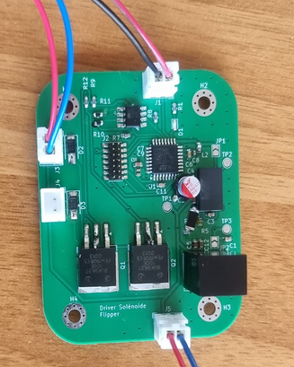

Lors des soudures nous avons rencontré plusieurs problèmes tels que des empreintes erronées (une résistance R et un condensateur sous-estimés en taille et une patte manquante sur les MOSFETs)
Lors des tests, le Buck de ce premier PCB est fortement monté en température. Nous sommes donc passé au montage suivant (PCB corrigé par Monsieur Papazoglou) :

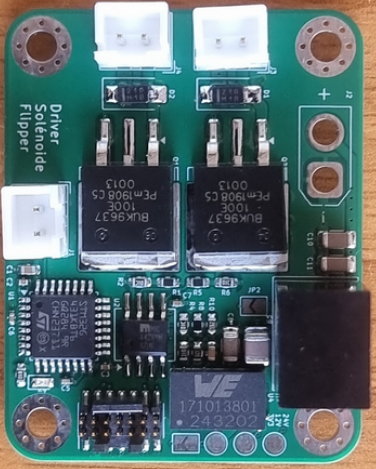

Lors des test, le Buck de ce PCB est également monté en température. Nous pensons que le problème viendrait d'un court-circuit créé lors de la soudure Pour poursuivre notre projet nous pensons donc changer le buck qui nous cause problème quel que soit le montage par le même type de régulateur à 3 pin que ce celui qui transforme le 24V en 12V. Nous avons construit le PCB avec la possibilité de séparer la partie puissance et la partie commande. Nous avons donc prévu de tester cette dernière lors des prochaines semaines et de commencer à concevoir le PCB final qui commandera l'ensemble du système.

## Software

Voici le shéma fonctionnel de notre système.
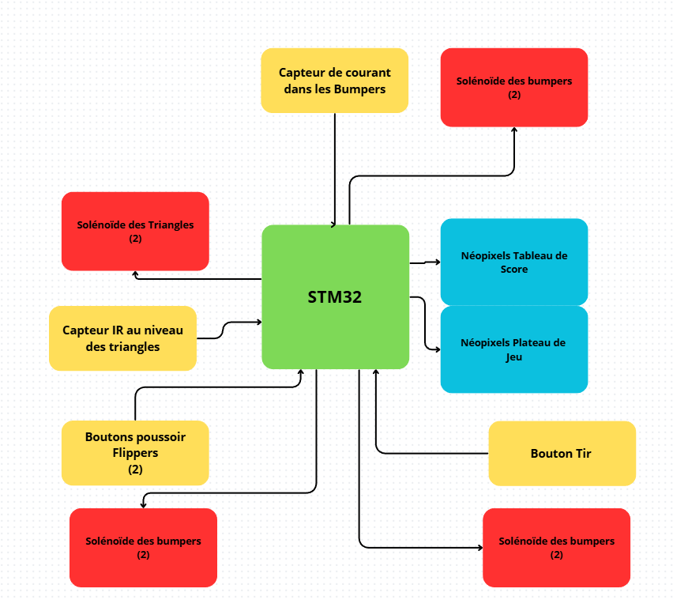

Il nous faut donc jeter un coup d'oeil aux différents capteurs afin de savoir quel information la STM va recevoir. 

## Le Châssis
Afin d'avoir un support pour notre flipper, nous avons dessiné sur Onshape un châssis en prenant en compte la pente réglementaire pour un Flipper classique qui est de **6,5 °**.

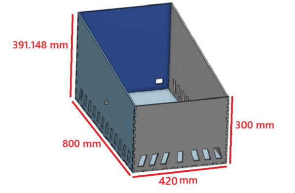

Le châssis comporte une ouverture afin d'y brancher l'alimentation ainsi que des aérations permettant la ventilation de notre système.
Après avoir réalisé ceci nous sommes entrain de faire la table de jeux qui sera réalisé en 2 couches (afin de pouvoir varier les épaisseurs et de pouvoir y emboîter les supports pour bumper ou batteur)

# Licence
Licence : MIT

Auteurs : Julie Deissard--Decot, Léonard Navizet, Maxime Beltoise, Johann Mansard
